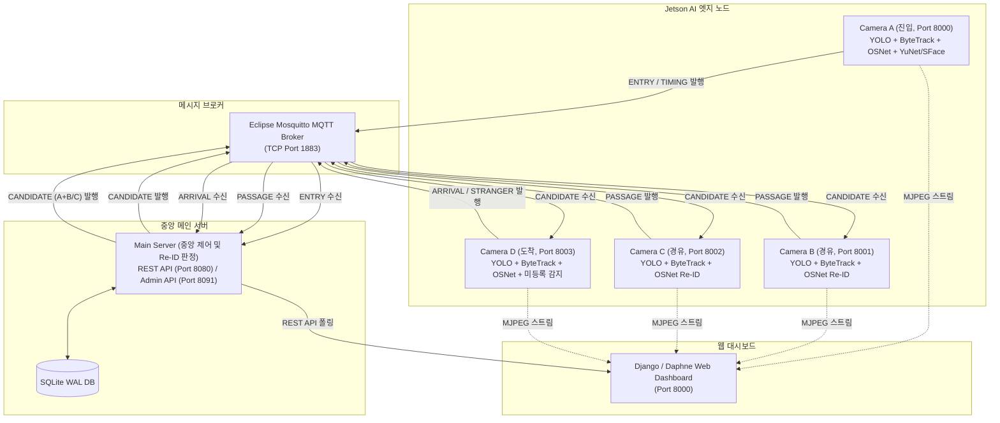

# 다중 카메라 기반 실시간 인원 이동 추적 및 재식별 시스템

다중 CCTV 환경에서 인공지능(AI) 기반 객체 탐지 및 재식별(Person Re-Identification, Re-ID) 기술을 활용하여, 여러 카메라 간 동일 인물의 이동 경로와 이동 시간을 실시간으로 추적하고 검증하는 통합 모니터링 시스템입니다.

---

## 1. 프로젝트 소개

본 시스템은 분산된 엣지 디바이스(**NVIDIA Jetson Orin Nano**)와 중앙 **메인 서버(Main Server)**, 그리고 **Django 웹 대시보드(Web Dashboard)**로 구성됩니다.

- **Camera A (진입 노드)**: 구역 진입 시 인물의 전신(Body) 및 얼굴(Face) 특징을 추출하여 최초 이동 세션(Journey)을 등록합니다.
- **Camera B / Camera C (경유 노드)**: 중앙 서버로부터 활성 후보자(Candidate) 정보를 수신하여 구역 경유(Passage) 여부를 판정하고 특징 갤러리를 보강합니다.
- **Camera D (도착 노드)**: 누적된 후보자 갤러리와 비교하여 최종 목적지 도착(Arrival)을 검증하고, 미등록 배회자(Stranger)를 실시간 감지합니다.
- **Main Server (중앙 관리 서버)**: MQTT 메시지 브로커를 통해 이벤트를 수신하고, 인물 식별자(Person UID)와 이동 세션(Journey ID)을 매핑·저장(SQLite WAL)하며 전체 파이프라인 상태를 제어합니다.
- **Django Web Dashboard (관리자 대시보드)**: 실시간 카메라 스트림, 이동 경로 시각화, 인원 통계 및 데이터베이스 관리 인터페이스를 제공합니다.

---

## 2. 시스템 구성



> **참고**: Eclipse Mosquitto MQTT Broker는 메인 서버와 분리된 독립 네트워크 메시지 중계 서비스로 동작합니다.

---

## 3. 주요 기능

- **객체 탐지(Object Detection)**: YOLO26n 기반 고속 사람 탐지
- **로컬 객체 추적(Local Tracking)**: ByteTrack 알고리즘 기반 단일 카메라 내 인물 트랙 유지
- **전신 재식별(Body Re-ID)**: OSNet x0.25 FP16 TensorRT 엔진 기반 512차원 특징 벡터(Embedding) 추출
- **얼굴 인식(Face Recognition)**: YuNet(얼굴 검출) + SFace(128차원 얼굴 특징 추출) 결합
- **카메라 간 교차 식별(Cross-Camera Re-ID)**: 코사인 유사도(Cosine Similarity) 및 멀티 갤러리 매칭
- **Person / Journey 분리 관리**: 영구 인물 식별자(Person UID)와 방문 세션 식별자(Journey ID) 독립 관리
- **신규 방문 및 재방문 판정**: 과거 등록 갤러리 비교를 통한 방문 횟수(Visit Count) 및 재방문자 자동 분류
- **이동 경로 검증(Route Validation)**: `A → B → D` 및 `A → C → D` 정상 경로 이탈 및 역주행 방지
- **이동 시간 검증(Temporal Guardrails)**: B/C 통과 후 D 도착까지의 실측 시간이 1~300초 범위인지 확인하고 타임스탬프 유효성 검사
- **미등록자 감지(Stranger Detection)**: 후보자에 등록되지 않은 인물의 체류 감지 및 경보 발행
- **비동기 메시징**: MQTT QoS 1 기반 메시지 무손실 전달 및 실시간 이벤트 동기화
- **고신뢰성 데이터 저장**: SQLite WAL(Write-Ahead Logging) 모드 기반 동시성 트랜잭션 처리
- **REST / Admin API**: 외부 서비스 연동용 REST API 및 데이터베이스 관리 전용 제어 API 제공
- **Django 대시보드**: Daphne ASGI 기반 실시간 웹소켓 이벤트 갱신 및 MJPEG 다중 뷰어

---

## 4. 사용 기술

| 구분 | 기술 / 라이브러리 | 버전 / 상세 |
|---|---|---|
| **객체 탐지(Object Detection)** | YOLO26n (Ultralytics) | `ultralytics==8.4.112` |
| **객체 추적(Tracking)** | ByteTrack | `lap==0.5.12` |
| **전신 재식별(Body Re-ID)** | OSNet x0.25 (FP16 TensorRT) | 512-D L2 정규화 임베딩 |
| **얼굴 검출(Face Detection)** | YuNet (OpenCV DNN) | `face_detection_yunet_2023mar.onnx` |
| **얼굴 인식(Face Recognition)** | SFace (OpenCV DNN) | `face_recognition_sface_2021dec.onnx` (128-D) |
| **AI 런타임 가속** | NVIDIA TensorRT / CUDA | TensorRT 10.3.0 / CUDA 12.6 |
| **엣지 디바이스(Edge Device)** | NVIDIA Jetson Orin Nano | Ubuntu 22.04 LTS (JetPack 6.x / L4T R36.5.0) |
| **메시지 브로커(Messaging)** | Eclipse Mosquitto / Paho MQTT | MQTT v2.x / `paho-mqtt==2.1.0` (QoS 1) |
| **메인 서버(Main Server)** | Python 3.10 | Windows 11 Pro 64-bit / Linux |
| **데이터베이스(Database)** | SQLite 3 (WAL 모드) | 내장 `sqlite3` + JSON 트랜잭션 아카이브 |
| **웹 대시보드(Web Dashboard)**| Django / Daphne (ASGI) | Django 5.x / Daphne 4.1 / Redis / WhiteNoise |
| **통신 프로토콜(API)** | HTTP REST / WebSocket | JSON 스키마 기반 데이터 핸드오프 |
| **개발 언어** | Python | 3.10.x |

---

## 5. 시스템 노드 역할

### Camera A — 진입 노드 (Entry Node)
- **역할**: 구역 진입 인물 탐지, 트랙 생성, 전신 512-D 임베딩 및 얼굴 128-D 임베딩 추출, 최초 ENTRY 이벤트 발행
- **웹 포트**: `8000` (MJPEG 스트림 및 캡처 확인)
- **주요 MQTT 토픽**:
  - 발행: `cctv/events/a/entry` (QoS 1)
  - 발행: `cctv/events/a/timing` (QoS 0)
  - 구독: `cctv/responses/a/entry` (QoS 1)

### Camera B — 경유 노드 (Passage Node)
- **역할**: 중앙 서버로부터 B 경로 후보자 수신, 실시간 영상 속 인물과 코사인 유사도 매칭, 고화질 갤러리 보강 및 PASSAGE 이벤트 발행
- **웹 포트**: `8001` (MJPEG 스트림)
- **주요 MQTT 토픽**:
  - 구독: `cctv/candidates/b` (QoS 1)
  - 발행: `cctv/events/b/passage` (QoS 1)

### Camera C — 경유 노드 (Passage Node)
- **역할**: 중앙 서버로부터 C 경로 후보자 수신, 실시간 Re-ID 매칭 수행, 통과 검증 및 PASSAGE 이벤트 발행
- **웹 포트**: `8002` (MJPEG 스트림)
- **주요 MQTT 토픽**:
  - 구독: `cctv/candidates/c` (QoS 1)
  - 발행: `cctv/events/c/passage` (QoS 1)

### Camera D — 도착 노드 (Arrival Node)
- **역할**: A + B/C 갤러리가 통합된 후보자 수신, 다중 윈도우 검증 및 경계선 진입 판정, 최종 ARRIVAL 이벤트 발행, 미등록 인물 STRANGER 감지
- **웹 포트**: `8003` (MJPEG 스트림)
- **주요 MQTT 토픽**:
  - 구독: `cctv/candidates/d` (QoS 1)
  - 구독: `cctv/control/d/journey` (QoS 1)
  - 발행: `cctv/events/d/arrival` (QoS 1)
  - 발행: `cctv/events/d/timing` (QoS 0)
  - 발행: `cctv/events/d/detection` (QoS 1)

### Main Server (중앙 관리 서버)
- **역할**: 인물(Person) 및 이동(Journey) 생애주기 관리, 글로벌 Re-ID 판정, SQLite 영구 저장, 후보자(Candidate) 패키징 및 배포, REST API 제공
- **MQTT 브로커 포트**: `1883`
- **REST API 포트**: `8080`
- **Admin DB API 포트**: `8091`

### Web Dashboard (관리자 대시보드)
- **역할**: Django 기반 관리 UI, Main Server REST API 폴링 및 실시간 동기화, 카메라별 스트림 연동, 인원별 이동 이력 조회
- **웹 서비스 포트**: `8000` (Daphne ASGI 서버)

---

## 6. 데이터 처리 흐름

1. **인물 진입**: Camera A 영역으로 사람이 진입합니다.
2. **로컬 트래킹**: YOLO26n과 ByteTrack이 인물을 검출하고 로컬 트랙 ID를 발급합니다.
3. **특징 추출**: OSNet TensorRT 엔진으로 512차원 전신 임베딩을 생성합니다.
4. **얼굴 검출/인식**: 인물의 정면 얼굴이 인식되면 YuNet과 SFace로 128차원 특징을 추가 수집합니다.
5. **진입 이벤트 발행**: Camera A가 `cctv/events/a/entry`로 진입 데이터를 발행합니다.
6. **세션 생성**: Main Server가 신규/재방문 여부를 판정하고 Person UID 및 Journey ID를 발급합니다.
7. **후보자 배포**: Main Server가 Camera B(`cctv/candidates/b`) 및 Camera C(`cctv/candidates/c`)로 후보자 갤러리를 전송합니다.
8. **경유지 매칭**: 인물이 B 또는 C 구역을 지날 때 해당 노드가 실시간 Re-ID로 동일인임을 식별합니다.
9. **경유 이벤트 발행**: 통과 조건을 만족하면 `cctv/events/<b|c>/passage`로 통과 이벤트를 발행합니다.
10. **도착 후보자 갱신**: Main Server가 통과한 노드의 고화질 갤러리를 병합하여 Camera D(`cctv/candidates/d`)로 후보자를 전송합니다.
11. **도착 판정**: Camera D 구역 도착 시 경계선 진입 및 다중 프레임 매칭을 거쳐 최종 동일인임을 판정합니다.
12. **도착 이벤트 발행**: Camera D가 `cctv/events/d/arrival` 이벤트를 발행합니다.
13. **이동 완료 처리**: Main Server가 해당 Journey의 상태를 `COMPLETED`로 전환하고 최종 경로(`A → B → D` 또는 `A → C → D`)를 확정합니다.
14. **대시보드 표출**: Django Web Dashboard에 전체 이동 경로, 소요 시간, 캡처 사진이 실시간 갱신됩니다.

---

## 7. Person과 Journey 구조

데이터 모델은 영구 인물 정보와 일회성 방문 세션을 명확히 분리하여 관리합니다.

- **Person (영구 인물 식별자)**:
  - 고유한 한 명의 인물을 식별하는 영구 ID (예: `P000001`)
  - 얼굴 특징 및 대표 전신 갤러리가 저장되며 재방문 시에도 유지됩니다.
- **Journey (방문 세션 식별자)**:
  - 인물이 구역에 진입하여 나갈 때까지의 단일 이동 세션 ID (예: `J000001`)
  - 진입 시점, 경유 노드, 도착 시점, 이동 소요 시간, 상태(`IN_PROGRESS`, `COMPLETED`, `CANCELLED` 등)를 가집니다.

```text
[동일 인물의 다회 방문 예시]
첫 번째 방문: Person ID = P000001, Journey ID = J000001 (상태: COMPLETED)
두 번째 방문: Person ID = P000001, Journey ID = J000002 (상태: COMPLETED)
```

---

## 8. Re-ID 방식

### 전신 재식별 (Body Re-ID)
- **모델**: OSNet x0.25 (FP16 TensorRT 최적화 엔진)
- **입력**: NCHW `[1, 3, 256, 128]` RGB 정규화 텐서
- **출력**: 512차원 L2 정규화 벡터 (512-D Float Vector)
- **판정 원리**: 각 노드에서 추출된 실시간 임베딩과 수신된 후보자 갤러리 간 코사인 유사도(Cosine Similarity)를 계산합니다.
- **로컬 ID와의 차이**: ByteTrack ID는 카메라 내부에서만 유효한 임시 번호이므로, 서로 다른 카메라 간 동일인 판정에는 반드시 512차원 Re-ID 임베딩을 사용합니다.

### 얼굴 인식 (Face Recognition — Camera A 전용)
- **얼굴 검출(Detection)**: YuNet 2023mar (`FaceDetectorYN`) 모델을 사용하여 인물 크롭 내 얼굴 위치 및 5개 랜드마크를 고속 검출합니다.
- **얼굴 특징 추출(Recognition)**: SFace 2021dec (`FaceRecognizerSF`) 모델을 사용하여 정렬된 얼굴 영역에서 128차원 얼굴 임베딩을 추출합니다.
- **용도**: 최초 진입 시 신규 등록 및 재방문자 매칭 정밀도를 극대화하는 보조 식별자로 활용됩니다.

---

## 9. 프로젝트 폴더 구조

```text
├── cctv_main/                   # 중앙 메인 서버 모듈
│   ├── main_server.py           # 중앙 여정 코디네이터 및 MQTT 이벤트 핸들러
│   ├── api_server.py            # REST API 서버 (포트 8080)
│   ├── admin_control.py         # 관리자 DB 제어 API (포트 8091)
│   ├── capture_cache.py         # 캡처 이미지 캐시 매니저
│   └── revisit_diagnostics.py   # 재방문 진단 유틸리티
├── configs/                     # 시스템 및 노드 설정 파일
│   ├── mqtt.yaml                # 실제 런타임 MQTT 브로커 설정
│   ├── mqtt.example.yaml        # MQTT 설정 템플릿
│   ├── node_d_matching.yaml     # Camera D 매칭 임계값 및 가드레일 설정
│   ├── reid_config.yaml         # Re-ID 엔진 파라미터 설정
│   └── identity.yaml            # 인물 판정 가중치 설정
├── docs/                        # 시스템 공식 명세 문서
│   ├── INTEGRATION_HEADS.md     # 최종 통합 골든 커밋 SHA 기록
│   ├── ENVIRONMENT.md           # 역할별 상세 환경 및 의존성 매트릭스
│   ├── PORTS.md                 # 네트워크 포트 계약서
│   ├── MQTT_CONTRACT.md         # MQTT 토픽 및 메시지 스키마 계약서
│   └── integration/             # 카메라 노드별 통합 문서 (camera-a ~ d.md)
├── models/                      # 모델 정의 및 체크섬
│   └── MANIFEST.md              # 모델 파일 위치, 크기, SHA-256 명세
├── requirements/                # 다중 환경 분리 의존성 정의
│   ├── README.md                # 환경별 설치 가이드
│   ├── jetson-common.txt        # Jetson 공통 직계 패키지
│   ├── camera-a.txt             # Camera A 전용 패키지
│   ├── camera-b.txt             # Camera B 전용 패키지
│   ├── camera-c.txt             # Camera C 전용 패키지
│   ├── camera-d.txt             # Camera D 전용 패키지
│   ├── main-server.txt          # Main Server 전용 패키지
│   ├── web.txt                  # Web Dashboard 전용 패키지
│   └── snapshots/               # 실기기 런타임 freeze 스냅샷
├── scripts/                     # 노드 실행 및 서비스 제어 스크립트
│   ├── run_node_a.sh            # Camera A 실행 스크립트 (Bash)
│   ├── run_node_b.sh            # Camera B 실행 스크립트 (Bash)
│   ├── run_node_c.sh            # Camera C 실행 스크립트 (Bash)
│   ├── run_node_d.sh            # Camera D 실행 스크립트 (Bash)
│   ├── start_live_stack.ps1     # 메인 서버 스택 시작 (PowerShell)
│   └── stop_live_stack.ps1      # 메인 서버 스택 중지 (PowerShell)
├── src/                         # 공용 소스코드 및 노드 구현체
│   ├── common/                  # 공용 유틸 (config, journey, stranger detection)
│   ├── network/                 # MQTT 클라이언트 및 통신 모듈
│   ├── nodes/                   # 노드 실행 파일 (node_a, node_b, node_c, node_d)
│   ├── reid/                    # OSNet Re-ID 전처리 및 추론 엔진
│   └── server/                  # 프로토콜 어댑터 및 리포지토리
├── tests/                       # 단위/통합 테스트 코드 및 픽스처
└── web/                         # Django 웹 관리자 대시보드
    ├── config/                  # Django 프로젝트 설정 및 ASGI 설정
    ├── tracking/                # 대시보드 앱, 모델, 뷰, 마이그레이션
    ├── main_server_worker.py    # 메인 서버 REST API 실시간 연동 워커
    ├── manage.py                # Django 관리 스크립트
    ├── server.ps1               # 대시보드 서버 관리 스크립트 (PowerShell)
    └── requirements-web.txt     # 웹 대시보드 의존성 파일
```

---

## 10. 환경 구성

본 시스템은 이기종 플랫폼(Jetson Orin Nano, Windows/Linux PC)에서 구동되므로, **전체 시스템을 단일 `requirements.txt`로 통합 설치하지 않습니다.** 실행 대상 역할에 맞는 가상환경을 생성하고 설치합니다.

> **중요**: CUDA, cuDNN, TensorRT, JetPack 및 시스템 패키지는 `pip` 대상이 아니며 OS 레벨에서 사전 구축되어야 합니다.

### 1. Jetson AI 엣지 노드 (Camera A, B, C, D)
Jetson 하드웨어 가속이 포함된 Python 3.10 가상환경에서 설치합니다.
```bash
pip install -r requirements/camera-<a|b|c|d>.txt
```

### 2. Main Server (중앙 관리 서버)
Windows 또는 Linux의 Python 3.10 가상환경에서 설치합니다.
```powershell
pip install -r requirements/main-server.txt
```

### 3. Web Dashboard (웹 대시보드)
웹 대시보드 전용 가상환경에서 설치합니다.
```powershell
pip install -r web/requirements-web.txt
```

---

## 11. 환경 버전

`docs/ENVIRONMENT.md` 및 실제 하드웨어 런타임 freeze 결과에 기반한 환경 사양입니다.

| 역할 (Role) | 운영체제 (OS) | Python | CUDA | cuDNN | TensorRT | PyTorch | OpenCV |
|---|---|---|---|---|---|---|---|
| **Camera A** | Ubuntu 22.04 LTS (Jetson) | 3.10.12 | 12.6 | 9.3 | 10.3.0 | 2.8.0 | 4.11.0.86 |
| **Camera B** | Ubuntu 22.04 LTS (Jetson) | 3.10.12 | 12.6 | 9.3 | 10.3.0 | 2.3.0 | 4.11.0.86 |
| **Camera C** | Ubuntu 22.04 LTS (Jetson) | 3.10.12 | 12.6 | 9.3 | 10.3.0 | 2.3.0 | 4.11.0.86 |
| **Camera D** | Ubuntu 22.04 LTS (Jetson) | 3.10.12 | 12.6 | 9.3 | 10.3.0 | 2.3.0 | 4.8.0.76 |
| **Main Server** | Windows 11 Pro 64-bit | 3.10.11 | - | - | - | - | - |
| **Web Dashboard**| Windows 11 / Linux | 3.10.x | - | - | - | - | 4.9+ |

---

## 12. 모델 파일

AI 모델 바이너리는 용량 및 플랫폼 최적화 이유로 Git 리포지토리에 커밋하지 않습니다. `models/MANIFEST.md`에 명시된 SHA-256 검증을 통과한 승인된 모델 파일을 각 경로에 배치해야 합니다.

| 논리 모델명 | 배치 경로 | 필수 노드 | 설명 |
|---|---|---|---|
| **YOLO26n** | `yolo26n.pt` | A, B, C, D | 사람 객체 검출용 모델 |
| **OSNet x0.25 ONNX** | `models/reid/person_reid_osnet_x0_25.onnx` | 엔진 빌드용 | 512-D 임베딩 소스 모델 |
| **OSNet x0.25 FP16 Engine** | `models/reid/person_reid_osnet_x0_25_fp16.engine` | A, B, C, D | Jetson TensorRT 가속 Re-ID 추론 엔진 |
| **YuNet 2023mar** | `models/face/face_detection_yunet_2023mar.onnx` | A | 얼굴 영역 및 랜드마크 검출 |
| **SFace 2021dec** | `models/face/face_recognition_sface_2021dec.onnx` | A | 128-D 얼굴 특징 추출 모델 |

---

## 13. 실행 방법

정상적인 이벤트 수신 및 라우팅을 위해 다음 순서로 서비스를 기동합니다.

```text
[권장 기동 순서]
1. Mosquitto MQTT Broker
2. Main Server (REST API 및 코디네이터)
3. Camera D (도착 대기)
4. Camera B / Camera C (경유 대기)
5. Camera A (진입 시작)
6. Django Web Dashboard (모니터링)
```

### 1단계: MQTT 브로커 기동 (메인 서버 호스트)
```powershell
# Windows
mosquitto -c configs/mosquitto.main-server.conf
```
```bash
# Linux
sudo systemctl start mosquitto
```

### 2단계: Main Server 기동 (메인 서버 호스트)
```powershell
# Windows PowerShell
powershell -ExecutionPolicy Bypass -File scripts/start_live_stack.ps1
```
```bash
# Linux / 직접 실행
python -m cctv_main.main_server
```

### 3단계: Jetson 카메라 노드 기동 (각 Jetson 보드)
```bash
# Camera D (도착 노드)
./scripts/run_node_d.sh

# Camera B (경유 노드)
./scripts/run_node_b.sh

# Camera C (경유 노드)
./scripts/run_node_c.sh

# Camera A (진입 노드)
./scripts/run_node_a.sh
```

### 4단계: Django Web Dashboard 기동 (웹 호스트)
```powershell
# Windows PowerShell
powershell -ExecutionPolicy Bypass -File server.ps1 start
```
```bash
# Linux / 수동 실행
cd web
daphne -b 0.0.0.0 -p 8000 config.asgi:application &
python main_server_worker.py
```

---

## 14. MQTT Topic

`docs/MQTT_CONTRACT.md`에 명세된 공식 토픽 목록입니다.

| 발행자 (Publisher) | 토픽 (Topic) | 구독자 (Subscriber) | QoS | 설명 |
|---|---|---|---|---|
| **Camera A** | `cctv/events/a/entry` | Main Server | `1` | 구역 진입 이벤트 및 최초 임베딩 전달 |
| **Camera A** | `cctv/events/a/timing` | Main Server | `0` | Camera A 프레임 타임스탬프 및 하트비트 |
| **Main Server** | `cctv/responses/a/entry` | Camera A | `1` | 진입 응답 (발급된 Journey ID/Person UID) |
| **Main Server** | `cctv/candidates/b` | Camera B | `1` | B 노드 통과 매칭용 후보자 갤러리 전달 |
| **Camera B** | `cctv/events/b/passage` | Main Server | `1` | B 노드 경유 확인 및 보강 갤러리 전달 |
| **Main Server** | `cctv/candidates/c` | Camera C | `1` | C 노드 통과 매칭용 후보자 갤러리 전달 |
| **Camera C** | `cctv/events/c/passage` | Main Server | `1` | C 노드 경유 확인 및 보강 갤러리 전달 |
| **Main Server** | `cctv/candidates/d` | Camera D | `1` | D 노드 도착 매칭용 통합 갤러리(A+B/C) 전달 |
| **Main Server** | `cctv/control/d/journey`| Camera D | `1` | 세션 제어 신호 (취소, 강제종료, 타임아웃) |
| **Camera D** | `cctv/events/d/arrival` | Main Server | `1` | D 노드 도착 확인 이벤트 전달 |
| **Camera D** | `cctv/events/d/timing` | Main Server | `0` | Camera D 프레임 타임스탬프 및 하트비트 |
| **Camera D** | `cctv/events/d/detection`| Main Server / Web | `1` | 미등록 배회자(Stranger) 감지 이벤트 |
| **Main Server** | `cctv/main/journey/completed` | Web Dashboard | `1` | 전체 여정 완료 브로드캐스트 |

---

## 15. 포트 구성

`docs/PORTS.md`에 명세된 포트 할당 명세입니다.

| 서비스 / 노드 | 기본 포트 | 프로토콜 | 설명 |
|---|---|---|---|
| **Camera A** | `8000` | HTTP / MJPEG | 실시간 스트림 (`/stream`, `/`) |
| **Camera B** | `8001` | HTTP / MJPEG | 실시간 스트림 (`/stream`, `/`) |
| **Camera C** | `8002` | HTTP / MJPEG | 실시간 스트림 (`/stream`, `/`) |
| **Camera D** | `8003` | HTTP / MJPEG | 실시간 스트림 (`/stream`, `/captures/D/...`) |
| **MQTT Broker** | `1883` | MQTT (TCP) | Mosquitto 이벤트 메시지 브로커 |
| **Main REST API** | `8080` | HTTP / REST | 중앙 여정/인물/캡처 조회 API |
| **Main Admin API** | `8091` | HTTP / REST | 관리자 DB 상태/백업/초기화 API |
| **Django Web Dashboard** | `8000` | HTTP / WebSocket | 관리자 웹 대시보드 (Daphne ASGI) |

---

## 16. 테스트

### 비하드웨어 정적 구문 검사 (Static / Syntax Test)
Jetson GPU나 카메라 장치가 없는 통합 환경에서도 안전하게 구문을 검증합니다.
```bash
python -m compileall cctv_main
python -m compileall web
python -m py_compile src/nodes/node_a.py src/nodes/node_b.py src/nodes/node_c.py src/nodes/node_d.py
```

### 단위 및 프로토콜 테스트 (Unit / Protocol Tests)
```bash
# 여정 프로토콜 데이터 검증
python -m unittest tests/test_journey_protocol.py
```

### 노드별 검증 (Hardware Required)
실제 Jetson 보드, GPU 런타임, `/dev/video0` 카메라 장치가 연결된 환경에서 수행합니다.
- **Camera A**: `tests/face_reid/test_face_similarity.py` *(Hardware Required)*
- **Camera B**: `python tests/test_node_b_passage_e2e.py` *(Hardware Required)*
- **Camera C**: `python tests/test_node_c_passage_e2e.py` *(Hardware Required)*
- **Camera D**: `python -m unittest discover -s tests -p "test_node_d*.py"` *(Hardware Required)*
- **Web**: `python web/manage.py check`

---

## 17. Git Golden Source

본 리포지토리의 최종 `submission/final` 브랜치는 아래 6개 검증 완료된 골든 커밋(Golden Commit SHA)을 기준으로 엄격히 통합되었습니다.

| 역할 (Role) | 기준 브랜치 (Branch) | 골든 커밋 (Golden Commit SHA) |
|---|---|---|
| **Main Server** | `submission/main-server` | `c5b33cf13c96bfebb142ca507de65db36ac25c1c` |
| **Camera A** | `submission/camera-a` | `5a7d4d2841921412112eb394e91f7e0a6d7bfb47` |
| **Camera B** | `submission/camera-b` | `c83530f5019046343e1c53802255ddc113cc0bc8` |
| **Camera C** | `submission/camera-c` | `c7da2eece081d8261169c92d378be0da5b5f3b7f` |
| **Camera D** | `submission/camera-d` | `149422a277ee20e0bce3c7d1a5f58adcac681254` |
| **Web Dashboard** | `reid-admin-web` | `6c34b4805bf760dd01e26893ed5d62e7b4976cba` |

---

## 18. 주의사항

1. **AI 모델 바이너리 관리**: `.pt`, `.engine`, `.onnx` 바이너리는 Git에 커밋하지 않고 `models/MANIFEST.md`에 명시된 규격에 맞춰 별도 복사합니다.
2. **보안 및 환경설정**: 실제 비밀번호나 API 토큰이 포함된 `.env` 파일 및 운영 데이터베이스(`*.db`, `*.sqlite3`)는 커밋하지 않습니다.
3. **Jetson 환경 보존**: 각 Jetson 보드의 하드웨어 가속 PyTorch, torchvision, TensorRT 및 OpenCV 패키지가 PyPI 일반 휠 설치로 인해 덮어써지지 않도록 주의합니다.
4. **로컬 설정 분리**: 카메라별 네트워크 IP 및 로컬 설정은 현장 환경에 맞춰 `configs/mqtt.yaml` 또는 환경 변수로 설정합니다.
